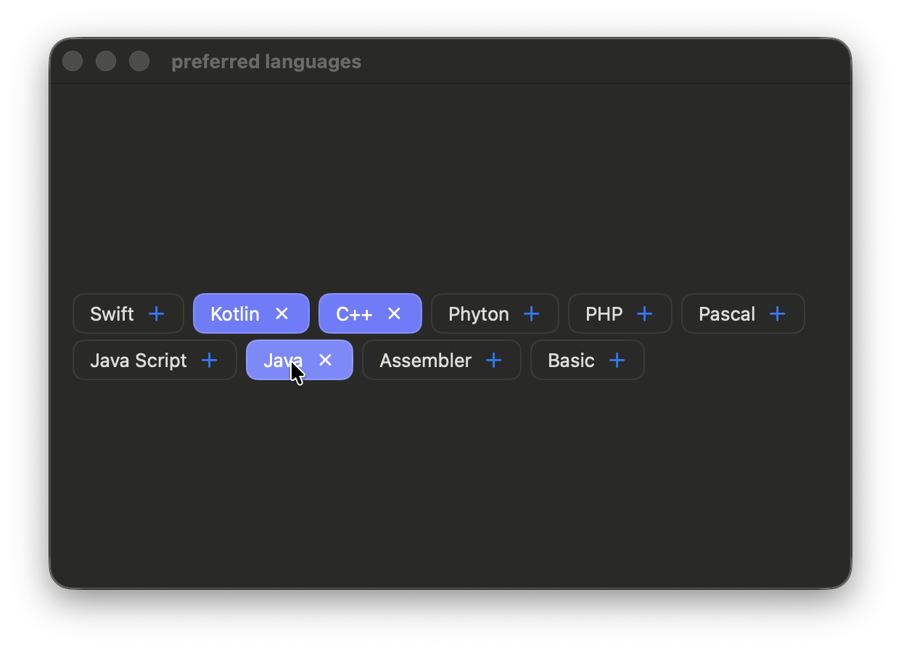
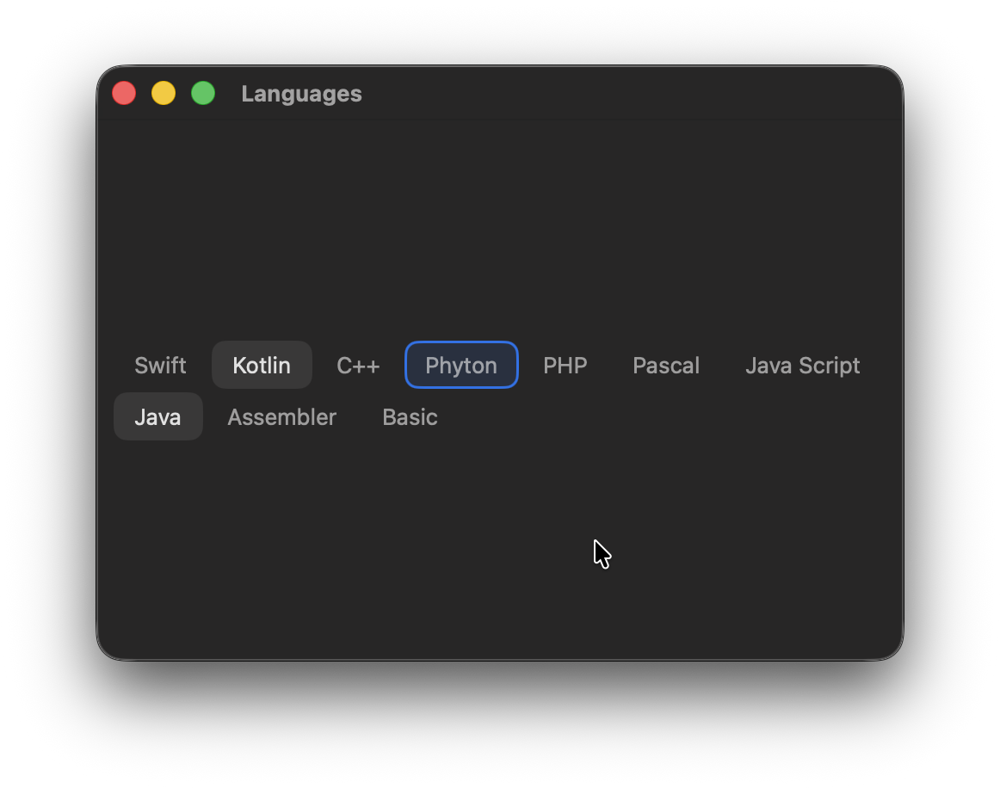
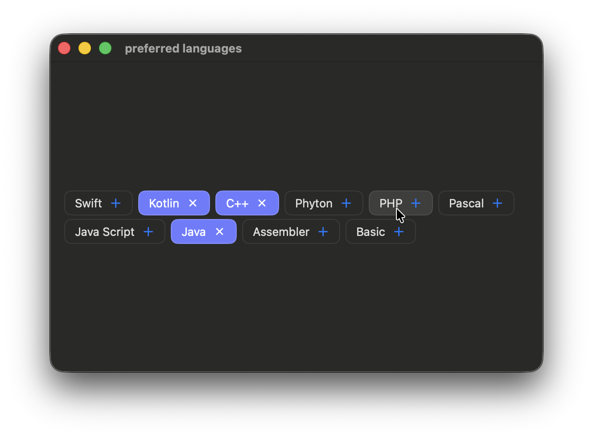

# FocusableTags

**FocusableTags** is a SwiftUI control for macOS that provides keyboard-focusable tags with full AppKit key-view loop integration and **multi-selection** support.

- Multiple selection (`Set<ID>`)
- Full keyboard navigation:
  - `Tab` / `Shift+Tab` — enter / leave the control
  - `←` `→` — cyclic navigation between tags
  - `Space` / `Enter` — toggle selection
- Proper **AppKit key-view loop** behavior
- Correct focus handling on mouse interaction
- Hover states
- Automatic line wrapping (`WrapLayout`)

<p float="left">
  
  
  
</p>

## Installation (Swift Package Manager)

File → Add Packages Dependencies… → https://github.com/Eugene-Kugut/FocusableTags.git


## Usage

```swift
import SwiftUI
import FocusableTags

enum DemoTag: String, CaseIterable, Hashable {
    case swift = "Swift"
    case kotlin = "Kotlin"
    case cpp = "C++"
    case phyton = "Phyton"
    case php = "PHP"
    case pascal = "Pascal"
    case js = "Java Script"
    case java = "Java"
    case asm = "Assembler"
    case basic = "Basic"
}

struct DemoView: View {
    @State private var selection: Set<DemoTag> = [.java, .kotlin]
    
    var body: some View {
        FocusableTags(
            items: DemoTag.allCases.map { tag in
                    .init(tag) {
                        Text(tag.rawValue)
                            .font(.body)
                            .foregroundStyle(selection.contains(tag) ? .primary : .secondary)
                    }
            },
            selection: $selection
        )
    }
}

```

## Customization

```swift
FocusableTags(
    items: items,
    selection: $selection,
    selectedBackground: Color.primary.opacity(0.12),
    focusedBackground: Color.accentColor.opacity(0.15),
    focusedOverlay: Color.accentColor,
    hoveredBackground: Color.primary.opacity(0.06),
    spacing: 4,
    cornerRadius: 10,
    alignment: HorizontalAlignment = .center
)
```
